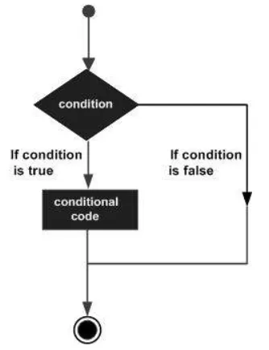

# 1. 第一个TypeScript脚本

- 安装Node.js和npm安装包管理器
- 全局安装TypeScript。以下这条命令会在全局安装一个TypeScript的解释器。
``` shell
npm install -g typescript
```
- 在项目文件夹中创建一个新的文件夹，并在终端中导航到该文件夹。然后运行以下命令来初始化一个新的TypeScript项目
``` shell
tsc --init
```
  - 在执行了以上的命令之后，这个文件夹内会生成一个tsconfig.json的文件。
- 创建一个名为 greet.ts 的文件。在文件中输入代码：

``` typescript
function greet(name:string){
    console.log(`Hello, ${name}!`);
}

greet("John");
```
- 使用TypeScript编译器（tsc）将TypeScript代码编译成JavaScript代码。在命令行中输入tsc命令。
  - 输入了tsc命令之后，可以看到文件夹下出现了一个greet.js的文件，这也就意味着TypeScript语言最后还是会转化为JavaScript语言进行解释和执行的。而且转化过后的js文件是使用严格模式执行的。
- 使用node greet.js 执行该文件。

# 2. TypeScript 基本语法

## 2.1 基本数据类型

| 数据类型 | 关键字 | 说明 |
|---------|-------|------|
| 任意类型 | `any` | 声明为 any 的变量可以赋予任意类型的值。 |
| 数字类型 | `number` | 双精度 64 位浮点值。它可以用来表示整数和分数。 |
| 字符串类型 | `string` | 一个字符系列，使用单引号（'）或双引号（"）来表示字符串类型。反引号（`）来定义多行文本和内嵌表达式。 |
| 布尔类型 | `boolean` | 表示逻辑值：true 和 false。 |
| 数组类型 | 无 | 声明变量为数组。 |
| 元组 | 无 | 元组类型用来表示已知元素数量和类型的数组，各元素的类型不必相同，对应位置的类型需要相同。 |
| 枚举 | `enum` | 枚举类型用于定义数值集合。 |
| void | `void` | 用于标识方法返回值的类型，表示该方法没有返回值。 |
| null | `null` | 表示对象值缺失。 |
| undefined | `undefined` | 用于初始化变量为一个未定义的值 |
| never | `never` | never 是其它类型（包括 null 和 undefined）的子类型，代表从不会出现的值。 |

## 2.2 变量声明

### 2.2.1 TypeScript 变量的命名规则

- 变量名称可以包含数字和字母
- 除了下划线 `_` 和美元 `$` 符号外，不能包含其他特殊字符，包括空格
- 变量名不能以数字开头

### 2.2.2 类型断言

- 类型断言可以用来手动指定一个值的类型，即允许变量从一种类型更改为另一种类型
- 当 S 类型是 T 类型的子集，或者 T 类型是 S 类型的子集时，S 能被成功断言成 T。这是为了在进行类型断言时提供额外的安全性，完全毫无根据的断言是危险的，如果你想这么做，你可以使用 `any`
- 它之所以不被称为类型转换，是因为转换通常意味着某种运行时的支持。但是，类型断言纯粹是一个编译时语法，同时，它也是一种为编译器提供关于如何分析代码的方法

### 2.2.3 变量作用域

- 变量作用域指定了变量定义的位置。程序中变量的可用性由变量作用域决定
- TypeScript 有以下几种作用域：
  - **全局作用域** - 全局变量定义在程序结构的外部，它可以在你代码的任何位置使用
  - **类作用域** - 这个变量也可以称为字段。类变量声明在一个类里头，但在类的方法外面。该变量可以通过类的对象来访问。类变量也可以是静态的，静态的变量可以通过类名直接访问
  - **局部作用域** - 局部变量，局部变量只能在声明它的一个代码块（如：方法）中使用

## 2.3 运算符

### 2.3.1 算术运算符

| 运算符 | 描述 | 例子 |
|--------|------|------|
| `+` | 加法 | `x = y + 2` |
| `-` | 减法 | `x = y - 2` |
| `*` | 乘法 | `x = y * 2` |
| `/` | 除法 | `x = y / 2` |
| `%` | 取模（余数） | `x = y % 2` |
| `++` | 自增 | `x = ++y` |
| `--` | 自减 | `x = --y` |

### 2.3.2 关系运算符

| 运算符 | 描述 | 比较 | 返回值 |
|--------|------|------|--------|
| `==` | 等于 | `x == 8` | `false` |
| `!=` | 不等于 | `x != 8` | `true` |
| `>` | 大于 | `x > 8` | `false` |
| `<` | 小于 | `x < 8` | `true` |
| `>=` | 大于或等于 | `x >= 8` | `false` |
| `<=` | 小于或等于 | `x <= 8` | `true` |

### 2.3.3 逻辑运算符

| 运算符 | 描述 | 例子 |
|--------|------|------|
| `&&` | and | `(x < 10 && y > 1)` 为 `true` |
| `\|\|` | or | `(x == 5 \|\| y == 5)` 为 `false` |
| `!` | not | `!(x == y)` 为 `true` |

### 2.3.4 位运算符

| 运算符 | 描述 | 例子 | 类似于 |
|--------|------|------|--------|
| `&` | AND，按位与处理两个长度相同的二进制数，两个相应的二进位都为 1，该位的结果值才为 1，否则为 0 | `x = 5 & 1` | `0101 & 0001` |
| `\|` | OR，按位或处理两个长度相同的二进制数，两个相应的二进位中只要有一个为 1，该位的结果值为 1 | `x = 5 \| 1` | `0101 \| 0001` |
| `~` | 取反，取反是一元运算符，对一个二进制数的每一位执行逻辑反操作。使数字 1 成为 0，0 成为 1 | `x = ~5` | `~0101` |
| `^` | 异或，按位异或运算，对等长二进制模式按位或二进制数的每一位执行逻辑异按位或操作。操作的结果是如果某位不同则该位为 1，否则该位为 0 | `x = 5 ^ 1` | `0101 ^ 0001` |
| `<<` | 左移，把 &lt;&lt; 左边的运算数的各二进位全部左移若干位，由 &lt;&lt; 右边的数指定移动的位数，高位丢弃，低位补 0 | `x = 5 << 1` | `0101 << 1` |
| `>>` | 右移，把 &gt;&gt; 左边的运算数的各二进位全部右移若干位，&gt;&gt; 右边的数指定移动的位数 | `x = 5 >> 1` | `0101 >> 1` |
| `>>>` | 无符号右移，与有符号右移位类似，除了左边一律使用0 补位 | `x = 2 >>> 1` | `0010 >>> 1` |

### 2.3.5 赋值运算符

| 运算符 | 例子 | 实例 | x 值 |
|--------|------|------|------|
| `=` (赋值) | `x = y` | `x = y` | `x = 5` |
| `+=` (先进行加运算后赋值) | `x += y` | `x = x + y` | `x = 15` |
| `-=` (先进行减运算后赋值) | `x -= y` | `x = x - y` | `x = 5` |
| `*=` (先进行乘运算后赋值) | `x *= y` | `x = x * y` | `x = 50` |
| `/=` (先进行除运算后赋值) | `x /= y` | `x = x / y` | `x = 2` |

### 2.3.6 三元运算符
- 三元运算有 3 个操作数，并且需要判断布尔表达式的值。该运算符的主要是决定哪个值应该赋值给变量。
  - Test ? expr1 : expr2
  - Test − 指定的条件语句
  - expr1 − 如果条件语句 Test 返回 true 则返回该值
  - expr2 − 如果条件语句 Test 返回 false 则返回该值

### 2.3.7 类型运算符
- typeof 运算符。typeof 是一元运算符，返回操作数的数据类型。
- instanceof 运算符用于判断对象是否为指定的类型

## 2.4 条件语句
- 条件语句用于基于不同的条件来执行不同的动作。
- TypeScript 条件语句是通过一条或多条语句的执行结果（True 或 False）来决定执行的代码块。可以通过下图来简单了解条件语句的执行过程:

- 在 TypeScript 中，我们可使用以下条件语句：
  - if 语句 - 只有当指定条件为 true 时，使用该语句来执行代码
  - if...else 语句 - 当条件为 true 时执行代码，当条件为 false 时执行其他代码
  - if...else if....else 语句- 使用该语句来选择多个代码块之一来执行
  - switch 语句 - 使用该语句来选择多个代码块之一来执行
- if语句的表达式如下：
``` javascript
if(boolean_expression){
    # 在布尔表达式 boolean_expression 为 true 执行
}
```
- if...else 语句的表达如下：
``` javascript
if(boolean_expression){
   # 在布尔表达式 boolean_expression 为 true 执行
}else{
   # 在布尔表达式 boolean_expression 为 false 执行
}
```
- if...else if ... else 语句的表达式如下：
``` javascript
if(boolean_expression 1) {
    # 在布尔表达式 boolean_expression 1 为 true 执行
} else if( boolean_expression 2) {
    # 在布尔表达式 boolean_expression 2 为 true 执行
} else if( boolean_expression 3) {
    # 在布尔表达式 boolean_expression 3 为 true 执行
} else {
    # 布尔表达式的条件都为 false 时执行
}
```
- switch...case 语句的表达式如下：
``` javascript
switch(expression){
    case constant-expression  :
       statement(s);
       break; /* 可选的 */
    case constant-expression  :
       statement(s);
       break; /* 可选的 */
  
    /* 您可以有任意数量的 case 语句 */
    default : /* 可选的 */
       statement(s);
}
```
- switch 语句必须遵循下面的规则：
  - switch 语句中的 expression 是一个要被比较的表达式，可以是任何类型，包括基本数据类型（如 number、string、boolean）、对象类型（如 object、Array、Map）以及自定义类型（如 class、interface、enum）等。
  - 在一个 switch 中可以有任意数量的 case 语句。每个 case 后跟一个要比较的值和一个冒号。
  - case 的 constant-expression 必须与 switch 中的变量 expression 具有相同或兼容的数据类型。
  - 当被测试的变量等于 case 中的常量时，case 后跟的语句将被执行，直到遇到 break 语句为止。
  - 当遇到 break 语句时，switch 终止，控制流将跳转到 switch 语句后的下一行。
  - 不是每一个 case 都需要包含 break。如果 case 语句不包含 break，控制流将会 继续 后续的 case，直到遇到 break 为止。
  - 一个 switch 语句可以有一个可选的 default case，出现在 switch 的结尾。default 关键字则表示当表达式的值与所有 case 值都不匹配时执行的代码块。default case 中的 break 语句不是必需的

## 2.5 循环语句

### 2.5.1 for循环
- 语法格式如下：
``` javascript
for ( init; condition; increment ){
    statement(s);
}
```
- 下面是 for 循环的控制流程解析：
1. init 会首先被执行，且只会执行一次。这一步允许您声明并初始化任何循环控制变量。您也可以不在这里写任何语句，只要有一个分号出现即可。
2. 接下来，会判断 condition。如果为 true，则执行循环主体。如果为 false，则不执行循环主体，且控制流会跳转到紧接着 for 循环的下一条语句。
3. 在执行完 for 循环主体后，控制流会跳回上面的 increment 语句。该语句允许您更新循环控制变量。该语句可以留空，只要在条件后有一个分号出现即可。
4. 条件再次被判断。如果为 true，则执行循环，这个过程会不断重复（循环主体，然后增加步值，再然后重新判断条件）。在条件变为 false 时，for 循环终止。

### 2.5.2 for ... in ... 循环
- 语法格式如下所示：
``` javascript
for (var val in list) { 
    //语句 
}
```
- val 需要为 string 或 any 类型。

### 2.5.3 for…of 、forEach、every 和 some 循环
- for ... of 循环语法

``` javascript
let someArray = [1, "string", false];
 
for (let entry of someArray) {
    console.log(entry); // 1, "string", false
}
```
- forEach 循环语法

``` javascript
let list = [4, 5, 6];
list.forEach((val, idx, array) => {
    // val: 当前值
    // idx：当前index
    // array: Array
});
```
- every和some语法

``` javascript
let list = [4, 5, 6];
list.every((val, idx, array) => {
    // val: 当前值
    // idx：当前index
    // array: Array
    return true; // Continues
    // Return false will quit the iteration
});
```

### 2.5.4 while循环
- while 语句在给定条件为 true 时，重复执行语句或语句组。循环主体执行之前会先测试条件。
- 语法如下

```
while(condition)
{
   statement(s);
}
```
- statement(s) 可以是一个单独的语句，也可以是几个语句组成的代码块。condition 可以是任意的表达式，当条件为 true 时执行循环。 当条件为 false 时，程序流将退出循环。while 循环的关键点是循环可能一次都不会执行。当条件为 false 时，会跳过循环主体，直接执行紧接着 while 循环的下一条语句。

### 2.5.5 do ... while 循环
● do...while 循环是在循环的尾部检查它的条件。语法如下所示
``` javascript
do
{
   statement(s);
}while( condition );
```
- 条件表达式出现在循环的尾部，所以循环中的 statement(s) 会在条件被测试之前至少执行一次。如果条件为 true，控制流会跳转回上面的 do，然后重新执行循环中的 statement(s)。这个过程会不断重复，直到给定条件变为 false 为止。

### 2.5.6 break和continue
- break 语句有以下两种用法：
  a. 当 break 语句出现在一个循环内时，循环会立即终止，且程序流将继续执行紧接着循环的下一条语句。
  b. 它可用于终止 switch 语句中的一个 case。
- 如果您使用的是嵌套循环（即一个循环内嵌套另一个循环），break 语句会停止执行最内层的循环，然后开始执行该块之后的下一行代码。
- continue 语句有点像 break 语句。但它不是强制终止，continue 会跳过当前循环中的代码，强迫开始下一次循环。
  - 对于 for 循环，continue 语句执行后自增语句仍然会执行。对于 while 和 do...while 循环，continue 语句重新执行条件判断语句。
### 2.5.7 无限循环
- 无限循环就是一直在运行不会停止的循环。 for 和 while 循环都可以创建无限循环。
- for 创建无限循环语法格式：
``` javascript
for(;;) { 
   // 语句
}
```
-  while 创建无限循环语法格式
``` javascript
while(true) { 
   // 语句
} 
```
## 2.6 函数
- 函数是一组一起执行一个任务的语句。
- 函数声明告诉编译器函数的名称、返回类型和参数。函数定义提供了函数的实际主体。

### 2.6.1 函数定义
- 语法格式如下所示：

``` javascript
function function_name()
{
    // 执行代码
}
```

### 2.6.2 函数调用
- 函数只有通过调用才可以执行函数内的代码。语法格式如下所示：
``` javascript
function_name()
```

### 2.6.3 函数返回值
- 语法格式如下所示：
``` javascript
function function_name():return_type { 
    // 语句
    return value; 
}
```
- return_type 是返回值的类型。
- return 关键词后跟着要返回的结果。
- 一般情况下，一个函数只有一个 return 语句。
- 返回值的类型需要与函数定义的返回类型(return_type)一致。

### 2.6.4 带参函数
- 在调用函数时，您可以向其传递值，这些值被称为参数。这些参数可以在函数中使用。
- 可以向函数发送多个参数，每个参数使用逗号 , 分隔。语法格式如下所示：
``` javascript
function func_name( param1 [:datatype], param2 [:datatype]) {   
}
```

### 2.6.5 可选参数和默认参数
- 在 TypeScript 函数里，如果我们定义了参数，则我们必须传入这些参数，除非将这些参数设置为可选，可选参数使用问号标识 ？。可选参数必须跟在必需参数后面。
- 默认参数。可以设置参数的默认值，这样在调用函数的时候，如果不传入该参数的值，则使用默认参数，语法格式为：
``` javascript
function function_name(param1[:type],param2[:type] = default_value) { 
}
```
- 剩余参数。剩余参数语法允许我们将一个不确定数量的参数作为一个数组传入。示例：
``` javascript
function addNumbers(...nums:number[]) {  
    var i;   
    var sum:number = 0; 
    
    for(i = 0;i<nums.length;i++) { 
       sum = sum + nums[i]; 
    } 
    console.log("和为：",sum) 
 } 
 addNumbers(1,2,3) 
 addNumbers(10,10,10,10,10)
```

### 2.6.6 匿名函数
- 匿名函数是一个没有函数名的函数。匿名函数在程序运行时动态声明，除了没有函数名外，其他的与标准函数一样。
- 代码格式如下：
``` javascript
var res = function( [arguments] ) { ... }
```